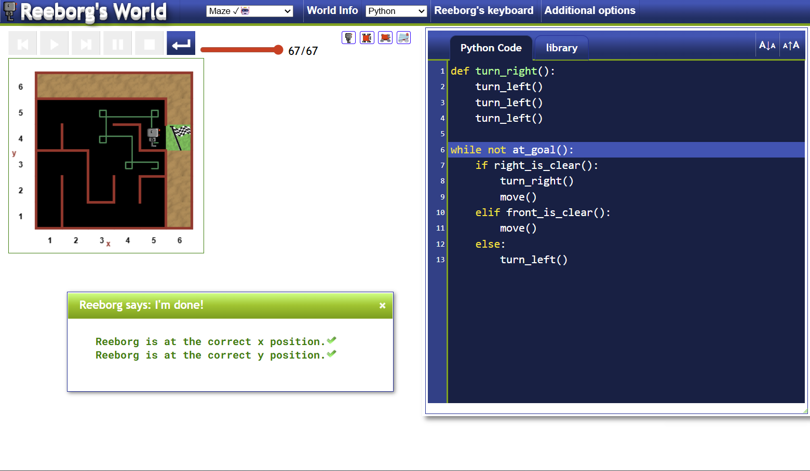

# Day 6: Escaping the Maze (Reeborg's World)

## 🎯 Project Goal
The mission for today was to program a robot named Reeborg to navigate a randomly generated maze using Python. Unlike previous days where the path was predictable, the maze requires a dynamic solution that can handle any wall configuration.

## 🧠 Key Concepts Learned
* **Defining Functions:** Creating custom blocks of code (like `turn_right()`) to make the main logic more readable.
* **While Loops:** Using `while not at_goal():` to keep the robot moving until a specific condition is met, rather than a fixed number of times.
* **Conditionals (if/elif/else):** Implementing a "Right-Hand Rule" logic to navigate walls.
* **Indentation & Logic Flow:** Managing complex nested loops and conditions.

## 🛠️ The Logic: The "Right-Hand Rule"
To ensure Reeborg doesn't get stuck in a loop or hit a wall, I implemented the following priority logic:
1. **Can I turn right?** If yes, turn right and move (this keeps us hugging the right wall).
2. **Can I move forward?** If I can't turn right, try to go straight.
3. **Nothing else?** Turn left to find a new path.

## 📸 Final Result

## 📝 Note on Code Execution
> **Important:** The logic implemented in `maze.py` relies on built-in functions specific to the **Reeborg's World** environment (such as `move()`, `turn_left()`, and `right_is_clear()`). As such, the code is intended for documentation of algorithmic logic and will not execute on a local machine without the corresponding simulation library.